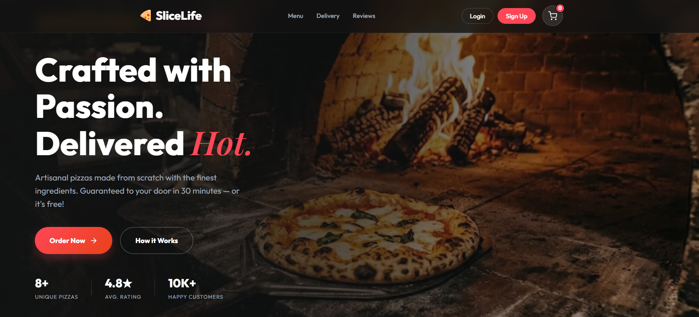

# 🍕 SliceLife - Pizza Ordering App

SliceLife is a simple and user-friendly pizza ordering web application developed as part of my **WTL Endsem Practical Questions**. It allows users to browse pizzas, customize their choices, and place orders seamlessly.

## 🌐 **[Live Demo](https://slicelife.vercel.app)**

## ✨ Features

- **Modular Architecture**: Clean separation of concerns with dedicated CSS and JS modules for State, UI, Cart, Auth, and Payments.
- **Dynamic Menu**: Fetches pizza data from a local JSON database.
- **Category Filtering**: Browse through Classic, Veg, and Non-Veg categories seamlessly.
- **Cart Management**: Add/remove items, update quantities, and view real-time subtotal calculations.
- **User Authentication**: Integrated Login and Sign-up modals with local storage persistence.
- **Detailed Pizza Views**: Interactive modals showcasing ingredients, descriptions, and customer reviews.
- **Review System**: Users can leave star ratings and comments on their favorite pizzas.
- **Checkout Flow**: Complete payment simulation with address validation and multiple payment methods (Card, UPI, COD).
- **Responsive Design**: Fully optimized for Desktop, Tablet, and Mobile devices.

## 🛠️ Tech Stack

- **Frontend**: HTML, CSS, JavaScript
- **Data Handling**: JSON file for menu, LocalStorage for cart & session
- **Icons & Fonts**: Google Fonts & SVG icons
